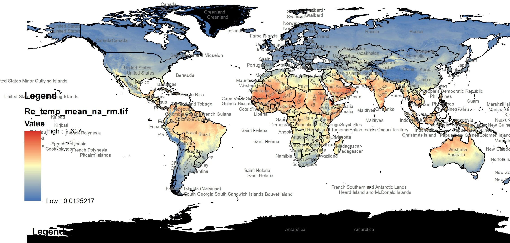
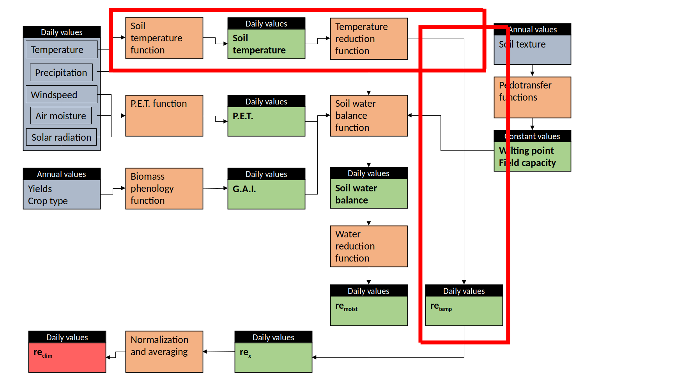

```{r setup, include=FALSE}
knitr::opts_chunk$set(echo = FALSE)
```

## Climate scaling?

It is very well known that microbial activity, ultimately the driver of SOM decomposition, is influenced by climatic parameters.  


<div style="float: left; width: 48%;">
In particular, the **temperature** at which microbes are exposed causes an exponential increase of their activity as of any chemical reaction.  
{width=100%}
Lloyd, J., Taylor, J.A., 1994. On the Temperature Dependence of Soil Respiration. Functional Ecology 8, 315. 
</div>

<div style="float: right; width: 48%;">
The **water content** of soil is a more complicated driver, since it affects the dormancy status of microbes in their micro-enrivonment.
{width=90%}
Moyano, F.E., Manzoni, S., Chenu, C., 2013. [...] Soil Biology and Biochemistry 59, 72–85. 
</div>


## Climate scaling?
The most basic version of the ICBM model can be modified by rescaling the decay kinetics with climate:
$$
\frac{dY}{dt}=I_{(t)} - k_y \cdot \color{red}{r} \cdot Y \\
\frac{dO}{dt}= h \cdot k_y \cdot \color{red}{r}  \cdot Y  - k_o \cdot \color{red}{r}  \cdot O
$$
This scaling can be introduced as a variable over time ($r_{(t)}$) or as an average constant value ($\bar{r}$) (of course introducing a scaling variable over time destroys the steady state assumption).  
  
The scaling is a function of soil temperature and soil moisture:
$r_{(t)}= f(temp, moist)$
And it does literally what it says: it rescales the kinetics $k_y$ and $k_o$ for the effect of climate, for example an increas or decrease of the microbial activity due to temperature.

## Climate scaling

Such scaling is composed by at least the two components of temperature and moisture. In ICBM this is done with a linear assumption of the effects:
$$r_{clim}= r_{temp} \cdot r_{moist}$$
But there is no difficulty in adding more processes if we think they are affecting the kinetics (for example we might want to represent clay protection as an additional linear term here, of course constant in this case since clay content in soil is always constant.)


## Temperature scaling
{width=90%}


## Temperature scaling
There are various possibilities to represent the effect of temperature on microbial activity. These functions are classifiable under the following three groups:  

<div style="float: left; width: 33%;">
*Linear:* representing the increase in activity with temperature
```{r echo=FALSE, out.width="100%"}
plot(seq(1:20), seq(1:20), type="l", xaxt="n", yaxt="n", ylab="", xlab="", col="blue")
```  
</div>

<div style="float: left; width: 33%;">
*Non-linear but monotonic:* representing the increase in activity with temperature in a more realistic way  
```{r echo=FALSE, out.width="100%"}
plot(seq(1:20), seq(1:20)^2, type="l", xaxt="n", yaxt="n", ylab="", xlab="", col="blue")
```  
**ICBM relies on a function of this kind**. It is a very common approach, e.g. Arrhenius or Q10.
</div>

<div style="float: right; width: 33%;">
*Non-linear and non-monotonic:* representing the increase in activity with temperature and subsequent decrease due to processes like protein denaturation.
```{r echo=FALSE, out.width="100%"}
p = seq(0,1, length=100)
plot(p, dbeta(p, 2, 2), type='l', xaxt="n", yaxt="n", ylab="", xlab="", col="blue")
```  
This is relatively rare (e.g. Daniel and Danson, 2010) due to the fact that rarely the soil reaches denaturation temperatures.
</div>


## Moisture scaling
{width=90%}

## Moisture scaling
Also for moisture the functions are classifiable under three groups:

<div style="float: left; width: 33%;">
*Linear:* representing the increase in activity with soil water content
```{r echo=FALSE, out.width="100%"}
plot(seq(1:20), seq(1:20), type="l", xaxt="n", yaxt="n", ylab="", xlab="", col="blue")
```  
</div>

<div style="float: left; width: 33%;">
*Non-linear but monotonic:* representing the increase in activity with soil water content in a more realistic way  
```{r echo=FALSE, out.width="100%"}
plot(seq(1:20), seq(1:20)^2, type="l", xaxt="n", yaxt="n", ylab="", xlab="", col="blue")
```  
**ICBM relies on a function of this kind, but...**
</div>

<div style="float: right; width: 33%;">
*Non-linear and non-monotonic:* representing the increase in activity with soil water content and subsequent decrease due to lack of oxygen. In this case the latter part of the curve is more common in nature than for the temperature response. 
```{r echo=FALSE, out.width="100%"}
p = seq(0,1, length=100)
plot(p, dbeta(p, 2, 2), type='l', xaxt="n", yaxt="n", ylab="", xlab="", col="blue")
```  
**...we are updating it to a function of this kind**
</div>

## Combination
{width=90%}


## The steps of the calculation

While soil temperature does not pose big problems (we usually need to estimate it based on air temperature but we can use it at any aggregation level), soil water content is usually not measured and without available proxyes, and needs to be simulated.
  
Such simulation involves simulating the soil water balance, where inputs is what rains and outputs is what evaporates or leaches.  
In this case the time scale does matter because precipitations accumulate. For example the average monthly precipitations is very different from the soil water balance (or even just all the water inputs) of that month.

## The steps of the calculation
{width=90%}


## The steps of the calculation | Temperature scaling
{width=70%}


## The steps of the calculation | Temperature scaling
The scaling for temperature is relatively straightforward:

1. Estimate soil temperature from air temperature  
2. Calculate the temperature scaling based on soil temperature  

## The steps of the calculation | Calculating the soil water balance
{width=70%}

## The steps of the calculation 
The scaling for soil moisture is more complicated since it involves estimating the soil water content.  
For this we need to:  

1. **Estimate the losses of water from soil due to evapotranspiration**  
1.1 Estimate P.E.T.  
1.2 Estimate the evapotranspiration due to crops  
1.3 Estimate the total amount of water that can be retained
  
2. **Calculate the water balance based on daily data**

## The steps of the calculation | Soil water content scaling
{width=70%}
After this we can directly estimate the climate scaling due to soil water content.


## Current choices in ICBM
