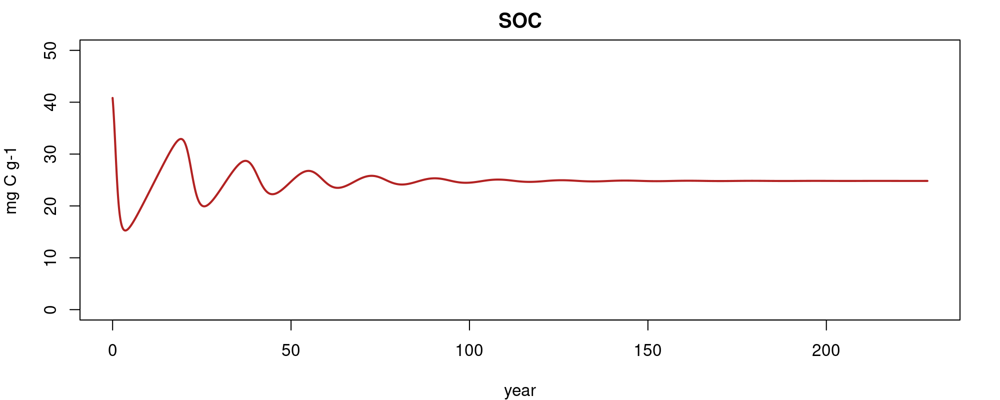

```{r setup, include=FALSE}
knitr::opts_chunk$set(echo = FALSE)
```

## Soil organic matter gets interesting (1804)
<div class="columns-2">
  <div class="centered">
  {height=50%}
  </div>

Some systematic observations about SOM:  

1. since no continuous accumulation of SOM occurs even with continuous organic inputs, some of these inputs must be destroyed,
2. the amount which is destroyed must, to a certain extent, be proportional to the absolute existing amount,
3. limits to SOM accretion must vary depending on climate, nature of mother bedrock, vegetation, cropping system and fertility of the land,
4. even if all conditions are favorable to SOM accumulation, there must be a maximum for the thickness of the humus layer beyond which destructive causes equal productive ones.

</div>

## Soil organic matter gets attention (1938)

A more structured approach to understand its nature initiated during past century:

{width=70%}

*Waksman, S.A., 1938. Humus. Origin, Chemical Composition and Importance in Nature, second ed. revised. Williams and Wilkins, Baltimore, p. 526*


## The Beginning of the conventional SOC decay theory (1945)
Hénin and Dupuis are probably the first to conceptualize a SOC ($C_s$) decay model:
$$
\frac{dC_s}{dt} = h \cdot C_i - k \cdot C_s
$$
In their formulation, the inputs to the SOC are defined by the C inputs $C_i$ times a humification constant $h$.

```{tikz, fig.cap = "", fig.ext = 'png', fig.width=5.5}
\usetikzlibrary{arrows,automata} 
    \begin{tikzpicture}[shorten >=1pt,node distance=2cm,>=stealth',thick]
        \node[state] (1) {$C_s$};
        \coordinate[left of=1] (d1);
        \coordinate[right of=1] (d2);
        \draw [->] (d1) to node[auto] {$h \cdot C_i$} (1);
        \draw [->] (1) to node[auto] {$k \cdot C_s$} (d2);
    \end{tikzpicture}
    
```


## The Beginning of the conventional SOC decay theory (1963)
<div class="columns-2">
  <div class="centered">
  {width=50%}
  </div>

Jerry Olson stated in the incipit of his SOC modeling paper: *"The net rate of change in energy or material stored in an ecological system or its parts equals the **rate of income** minus the **rate of loss**."*

```{tikz, fig.cap = "", fig.ext = 'png', fig.width=2.5}
\usetikzlibrary{arrows,automata} 
    \begin{tikzpicture}[shorten >=1pt,node distance=2cm,>=stealth',thick]
        \node[state] (1) {$C_s$};
        \coordinate[left of=1] (d1);
        \coordinate[right of=1] (d2);
        \draw [->] (d1) to node[auto] {$I$} (1);
        \draw [->] (1) to node[auto] {$k \cdot C_s$} (d2);
    \end{tikzpicture}
    
```

And described it mathematically with a linear differential equation very similar to Hénin and Dupuis model:
$$
\frac{dC_s}{dt} = I - k \cdot C_s
$$
Compared to Hénin and Dupuis, the term $I$ substitutes $h \cdot C_i$, but since $h$ is anyway a latent variable the two models are virtually the same. Such equation is still the basis for most SOC models available around.
</div>


## Differences between Olson and Hénin & Dupuis
While Olson's model is actually a single pool model, Hénin & Dupuis define the input flux to the soil as a fraction of the total C input $C_i$, which can describe the litter. When considering the implicit fluxes from the system (respiration), in order to close the mass balance, we need to account also for the respiration from the litter:

```{tikz, fig.cap = "", fig.ext = 'png', fig.width=3.5}
\usetikzlibrary{arrows,automata} 
    \begin{tikzpicture}[shorten >=1pt,node distance=2cm,>=stealth',thick]
        \node[state] (1) {$C_s$};
        \coordinate[left of=1] (d1);
        \coordinate[above of=1] (d2);
        \coordinate[above of=d1] (d0);
        \coordinate[left of=d1] (d00);
        \draw [->] (d00) to node[auto] {$C_i$} (d1);
        \draw [->] (d1) to node[auto] {$h \cdot C_i$} (1);
        \draw [->] (1) to node[auto] {$k \cdot C_s$} (d2);
        \draw [->] (d1) to node[auto] {$(1-h) \cdot C_i$} (d0);
    \end{tikzpicture}
    
```


## Many many many many SOC models

A **(badly incomplete)** list of the major (only linear ones, we'll come to this later) SOC models over time:

```{tikz, fig.cap = "", fig.ext = 'png', fig.width=10.5}
\usetikzlibrary{mindmap,shadows}

\begin{tikzpicture}[]
  
  % limits
  \newcount\yearOne; \yearOne=1940
  \def\w{15}    % width of axes
  \def\n{7}     % number of decades
  \def\lt{0.40} %  ten tick length
  \def\lf{0.36} % five tick length
  \def\lo{0.30} %  one tick length
  
  % help functions
  \def\yearLabel(#1,#2){\node[above] at ({(#1-\yearOne)*\w/\n/10},\lt) {#2};}
  \def\yearArrowLabel(#1,#2,#3,#4){
    \def\xy{{(#1-\yearOne)*\w/\n/10}}; \pgfmathparse{int(#2*100)};
    \ifnum \pgfmathresult<0
      \def\yyp{{(\lt*(0.90+#2))}}; \def\yyw{{(\yyp-\lt*#3)}}
      \draw[<-,thick,black,align=center] (\xy,\yyp) -- (\xy,\yyw) node[below,black] at (\xy,\yyw) {#4};
    \else
      \def\yyp{{(\lt*(0.10+#2)}}; \def\yyw{{(\yyp+\lt*#3)}}
      \draw[<-,thick,black,align=center] (\xy,\yyp) -- (\xy,\yyw) node[above,black] at (\xy,\yyw) {#4};
    \fi}
  
    \def\yearArrowLabelRed(#1,#2,#3,#4){
    \def\xy{{(#1-\yearOne)*\w/\n/10}}; \pgfmathparse{int(#2*100)};
    \ifnum \pgfmathresult<0
      \def\yyp{{(\lt*(0.90+#2))}}; \def\yyw{{(\yyp-\lt*#3)}}
      \draw[<-,thick,black,align=center] (\xy,\yyp) -- (\xy,\yyw) node[below,red] at (\xy,\yyw) {#4};
    \else
      \def\yyp{{(\lt*(0.10+#2)}}; \def\yyw{{(\yyp+\lt*#3)}}
      \draw[<-,thick,black,align=center] (\xy,\yyp) -- (\xy,\yyw) node[above,red] at (\xy,\yyw) {#4};
    \fi}
  
  % axis
  %\draw[thick] (0,0) -- (\w,0);
  \draw[->,thick] (-\w*0.03,0) -- (\w*1.03,0);
  
  % ticks
  \foreach \tick in {0,1,...,\n}{
    \def\x{{\tick*\w/\n}}
    \def\year{\the\numexpr \yearOne+\tick*10 \relax}
  	\draw[thick] (\x,\lt) -- (\x,-\lt) % ten tick
	             node[below] {\year};
	
	\ifnum \tick<\n
	  \draw[thick] ({(\x+\w/\n/2)},0) -- ({(\x+\w/\n/2)},\lf); % five tick
      \foreach \ticko in {1,2,3,4,6,7,8,9}{
        \def\xo{{(\x+\ticko*\w/\n/10)}}
  	    \draw[thick] (\xo,0) -- (\xo,\lo);  % one tick
	}\fi
  }
  
  % label
  \yearArrowLabelRed(1945, 1.0,1.0,Hénin and Dupuis model)
  \yearArrowLabelRed(1963, 1.0,1.0,Olson model)
  \yearArrowLabel(1996, 1.0,1.0,CANDY)
  \yearArrowLabel(1987, 1,1.5,Century)
  \yearArrowLabel(1991, 1,0.5,DAISY)
  \yearArrowLabel(2005, 1,1.0,Yasso)
  \yearArrowLabel(2001, 1,2.0,ROMUL)
  \yearArrowLabel(1992, 1,2.3,DNDC)
  \yearArrowLabel(1987, -1,2,RothC)
  \yearArrowLabel(1977,-1.0,2.0,\small RothC core idea )
  \yearArrowLabel(1997, -1,2.4,ICBM)
  \yearArrowLabel(1996, -1,1.3,Q)

  
\end{tikzpicture}
```

A relatively recent literature review (Campbell and Paustian 2015) found **87** different SOM models (and this not considering broader models, like complete ecosystem models, and more speculative studies on SOM model structures)


## The Golden Era: RothC (1977)
When computer power started to be reasonably available, more complex models trying to represent SOC in more detail arised. In the decades between the late 70s and late 90s the foundations of most currently used SOC models were laid. 
  {height=300}

## The Golden Era: Century (1987)

## An interesting outlier: Q
Q generalizes by assuming a continuous quality spectrum instead of discrete compartments.
```{r, echo=F}
x <- seq(-4, 4, length=100)

#create a vector of values that shows the height of the probability distribution
#for each value in x
y <- dnorm(x)

#plot x and y as a scatterplot with connected lines (type = "l") and add
#an x-axis with custom labels
plot(x,y, type = "l", lwd = 2, axes = FALSE, xlab = "quality", ylab = "amount of molecules represented")
box()

```
Very elegant, but in order to be mathematically manageable, it assumes a normal distribution for SOC quality (other assumptions can be made, but the model becomes hard to solve)


## The problem of model initialization

## The dream of "data-based" initialization: soil organic matter "quality"
  {height=450}

## The dream of "data-based" initialization: Yasso, Zimmerman, etc...
Many models have developed around the idea of having measurable pools, or such idea developed afterwards with specific fractionation techniques.
  {height=300}
But any fractionation will be based on an assumed conceptual model defining recalcitrance, simplifying a lot the quality function and imposing assumptions already on the data.  
It kind of works, kind of doesn't.


## Things get complicated
Soil C models are required to represent more things than just the aerobic C decomposition process.  
In the most recent decades we can observe a very large amount of models being published that are based on many different processes and integrate many components (es. ECOSSE, ORCHIDEE, DayCent).


## Representing reality?
<div class="columns-2">
  <div class="centered">
  {height=350}
  316 kB
  </div>

<div class="centered">
  {height=350}
  11 kB
  </div>

</div>

## One possible tree of SOC models concepts
```{tikz, fig.cap = "", fig.ext = 'png', fig.width=5.5}

\usetikzlibrary{mindmap,shadows}

\begin{tikzpicture}
  \path[mindmap,concept color=black,text=white]
    node[concept] {SOC decay models}
    [clockwise from=0]
    child[concept color=green!50!black] {
      node[concept] {Linear}
      [clockwise from=95]
      child { node[concept] {Minimalist}}
      child { node[concept] {Lab-based initialization}}
      child { node[concept] {Inert} }
      child { node[concept] {Feedback} }
      child[concept color=orange] { node[concept] {continuous} }
    }
    child[concept color=red] { node[concept] {Nonlinear} }

;
\end{tikzpicture}
```

## The basic SOM model choices

* Do we assume some "inert" SOM?
* How many different C pools do we represent?
* Do we represent mass feedbacks?
* Is it fine to use ordinary differential equations, or do we need PDE?

Each of these choices will bring implications in the extrapolation we can do with the model, some quite dramatic.


## The advantages of minimalism: introducing ICBM
ICBM is a rather minimalistic model with only two pools, one ($Y$) representing the young litter and another ($O$) representing the "old", or "humified", organic matter.  
<<<<<<< HEAD
The model is conceptually not so distant from Hénin and Dupuis model, and it becomes identical if the decay constant of the "young" pool, $k_y$, is set to $1$: all organic material coming to the soil is either instantly respired or transferred to the SOM.
=======
The model is conceptually not so distant from Hénin and Dupuis model, and it becomes identical if the decay constant of the "young" pool, $k_y$, is set to $1$. This would represent the assumption that all organic material coming to the soil is either instantly respired or transferred to the SOM, which is what is implied in Hénin and Depuis conceptualization.
>>>>>>> ed3fe0251ab00113bc3462cac586b4e6f7ed5e3e
```{tikz, fig.cap = "", fig.ext = 'png', fig.width=4.5}
\usetikzlibrary{arrows,automata} 
    \begin{tikzpicture}[shorten >=1pt,node distance=2.3cm,>=stealth',thick]
        \node[state] (1) {$O$};
        \node[state, left of=1] (d1) {$Y$};
        \coordinate[above of=1] (d2);
        \coordinate[above of=d1] (d0);
        \coordinate[left of=d1] (d00);
        \draw [->] (d00) to node[auto] {$I$} (d1);
        \draw [->] (d1) to node[auto] {$h \cdot k_y \cdot Y$} (1);
        \draw [->] (1) to node[auto] {$k_o \cdot O$} (d2);
        \draw [->] (d1) to node[auto] {$(1-h) \cdot k_y \cdot Y$} (d0);
    \end{tikzpicture}
    
```


## The advantages of minimalism: easily solved steady states
No system will accumulate or lose C indefinitely. The rates will always tend to zero.  
When the rate of SOC variation is zero, the system is in **equilibrium**, and inputs equal outputs. For example a land use change from a relatively rich environment (a forest) to an environment with less C inputs (agriculture). SOC will decrease over time until it reaches the new equilibrium:
```{r echo=FALSE, out.width="50%"}
X_0=50
k=0.1
tim=seq(1:100)
L=2
X=c(X_0,(L/k)*(1-exp(-k*tim))+X_0*exp(-k*tim))

plot(c(0,tim), X, type="l", ylim=c(0,55), ylab="C stocks", xlab="Time", yaxt="n", xaxt="n")
abline(h=X_0, lty=2, col="red")
text(10,X_0+1.2, "Initial steady state", col="red", cex=0.6)
abline(h=L/k, lty=2, col="darkgreen")
text(10,L/k+1.2, "Final steady state", col="darkgreen", cex=0.6)

```

## The advantages of minimalism: easily solved steady states
The steady states are, by definition, where the rate of variation $\frac{dC}{dt}=0$. For a single pool model (Olson) this becomes easily solved. The steady state means that for a certain amount of C $C_{ss}$ the variation is zero: $0 = I - k \cdot C_{ss}$, which means $k \cdot C_{ss} = I$ and therefore $C_{ss}=\frac{I}{k}$.
  
A slightly more complicated model, like the two pool (Y and O) ICBM, has still relatively simple analyitcal solution:
$$
Y_{ss}=\frac{I}{k_y}\\
O_{ss}=\epsilon\cdot\frac{I}{k_o}
$$
Any linear model, with an arbitrary number of pools, has an analytical solution. But having it so short and easily manageable can sometimes be useful.

## The advantages of more pools: long-term accuracy


## The cyclical discussion: "breaking" SOC decomposition paradigm?

TIMELINE HERE


## Representing reality: the view of experimentalists
{width=70%}
*Schimel, Joshua. “Modeling Ecosystem-Scale Carbon Dynamics in Soil: The Microbial Dimension.” Soil Biology and Biochemistry 178 (March 2023)*

## Representing reality: the view of experimentalists
We know that SOC decomposition is process mediated by microbes, their growth and by their exoenzymes production, so representing these processes will produce more accurate models.  

{width=55%}
*Schimel, Joshua. “Modeling Ecosystem-Scale Carbon Dynamics in Soil: The Microbial Dimension.” Soil Biology and Biochemistry 178 (March 2023)*

## The cyclical discussion: is more realistic more better?
Making decomposition controlled by enzymes/microbes means making the model nonlinear, moving from ordinary differential equations to partial differential equations.

{width=60%}

Nonlinearities in models can lead to weird behaviors, for example oscillations. Because of the nonlinear (more than linear) effects, any mistake can have an amplificated effect on predictions.

## More complicated (nonlinear) models bring extrapolation uncertainty

{width=60%}
Shi, Zheng, Sean Crowell, Yiqi Luo, and Berrien Moore. “Model Structures Amplify Uncertainty in Predicted Soil Carbon Responses to Climate Change.” Nature Communications 9, no. 1 (June 4, 2018)

## Scary: linear algebra for linear models
Compartmental models can be expressed within a generic linear algebra (matrix) notation
$$
\frac{dC_{(t)}}{dt}=I_{(t)} + A_{(t)} \cdot C_{(t)}
$$
For example the ICBM model (assuming constant average inputs), written explicitly, is:
$$
 \frac{dC_{(t)}}{dt}=\begin{bmatrix} I\\  0\\  \end{bmatrix} +
  \xi \cdot
    \begin{bmatrix} -k_y & \epsilon \\ 0 & -k_o  \end{bmatrix} \cdot
    \begin{bmatrix} Y \\ O \end{bmatrix}
$$
This notation allows us to generalize the main differences between model structures:
```{r}

df <- data.frame (first_column  = c("$I+\\xi \\cdot A \\cdot C_{(t)}$", "$I+\\xi \\cdot A (C_{(t)}) \\cdot C_{(t)}$"),
                  second_column = c("$I+\\xi_{(t)} \\cdot A \\cdot C_{(t)}$", "$I+\\xi (t) \\cdot A (C_{(t)}) \\cdot C_{(t)}$")
                  )
colnames(df)<-c("Autonomous", "Non-autonomous")
rownames(df)<-c("Linear", "Non-linear")
  
knitr::kable(df)
```

(it brings also the pretty neat advantage of an easy nalytical steady state for anything linear...)
