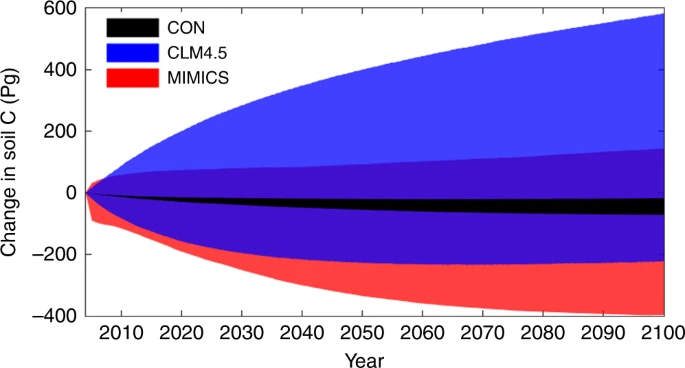

```{r setup, include=FALSE}
knitr::opts_chunk$set(echo = FALSE)
```

## Soil organic matter gets interesting (1804)
<div class="columns-2">
  <div class="centered">
  {height=50%}
  </div>

Some systematic observations about SOM:  

1. since no continuous accumulation of SOM occurs even with continuous organic inputs, some of these inputs must be destroyed,
2. the amount which is destroyed must, to a certain extent, be proportional to the absolute existing amount,
3. limits to SOM accretion must vary depending on climate, nature of mother bedrock, vegetation, cropping system and fertility of the land,
4. even if all conditions are favorable to SOM accumulation, there must be a maximum for the thickness of the humus layer beyond which destructive causes equal productive ones.

</div>

## Soil organic matter gets attention (1938)

A more structured approach to understand its nature initiated during past century:

{width=70%}

*Waksman, S.A., 1938. Humus. Origin, Chemical Composition and Importance in Nature, second ed. revised. Williams and Wilkins, Baltimore, p. 526*


## The Beginning of the conventional SOC decay theory (1945)
Hénin and Dupuis are probably the first to conceptualize a SOC ($C_s$) decay model:
$$
\frac{dC_s}{dt} = h \cdot C_i - k \cdot C_s
$$
In their formulation, the inputs to the SOC are defined by the C inputs $C_i$ times a humification constant $h$.

```{tikz, fig.cap = "", fig.ext = 'png', fig.width=5.5}
\usetikzlibrary{arrows,automata} 
    \begin{tikzpicture}[shorten >=1pt,node distance=2cm,>=stealth',thick]
        \node[state] (1) {$C_s$};
        \coordinate[left of=1] (d1);
        \coordinate[right of=1] (d2);
        \draw [->] (d1) to node[auto] {$h \cdot C_i$} (1);
        \draw [->] (1) to node[auto] {$k \cdot C_s$} (d2);
    \end{tikzpicture}
    
```


## The Beginning of the conventional SOC decay theory (1963)
<div class="columns-2">
  <div class="centered">
  {width=50%}
  </div>

Jerry Olson stated in the incipit of his SOC modeling paper: *"The net rate of change in energy or material stored in an ecological system or its parts equals the **rate of income** minus the **rate of loss**."*

```{tikz, fig.cap = "", fig.ext = 'png', fig.width=2.5}
\usetikzlibrary{arrows,automata} 
    \begin{tikzpicture}[shorten >=1pt,node distance=2cm,>=stealth',thick]
        \node[state] (1) {$C_s$};
        \coordinate[left of=1] (d1);
        \coordinate[right of=1] (d2);
        \draw [->] (d1) to node[auto] {$I$} (1);
        \draw [->] (1) to node[auto] {$k \cdot C_s$} (d2);
    \end{tikzpicture}
    
```

And described it mathematically with a differential equation very similar to Hénin and Dupuis model:
$$
\frac{dC_s}{dt} = I - k \cdot C_s
$$
Compared to Hénin and Dupuis, the term $I$ substitutes $h \cdot C_i$, but since $h$ is anyway a latent variable the two models are virtually the same. Such equation is still the basis for most SOC models available around.
</div>


## Many many many many SOC models

A **(badly incomplete)** list of the major (only linear ones, we'll come to this later) SOC models over time:

```{tikz, fig.cap = "", fig.ext = 'png', fig.width=10.5}
\usetikzlibrary{mindmap,shadows}

\begin{tikzpicture}[]
  
  % limits
  \newcount\yearOne; \yearOne=1940
  \def\w{15}    % width of axes
  \def\n{7}     % number of decades
  \def\lt{0.40} %  ten tick length
  \def\lf{0.36} % five tick length
  \def\lo{0.30} %  one tick length
  
  % help functions
  \def\yearLabel(#1,#2){\node[above] at ({(#1-\yearOne)*\w/\n/10},\lt) {#2};}
  \def\yearArrowLabel(#1,#2,#3,#4){
    \def\xy{{(#1-\yearOne)*\w/\n/10}}; \pgfmathparse{int(#2*100)};
    \ifnum \pgfmathresult<0
      \def\yyp{{(\lt*(0.90+#2))}}; \def\yyw{{(\yyp-\lt*#3)}}
      \draw[<-,thick,black,align=center] (\xy,\yyp) -- (\xy,\yyw) node[below,black] at (\xy,\yyw) {#4};
    \else
      \def\yyp{{(\lt*(0.10+#2)}}; \def\yyw{{(\yyp+\lt*#3)}}
      \draw[<-,thick,black,align=center] (\xy,\yyp) -- (\xy,\yyw) node[above,black] at (\xy,\yyw) {#4};
    \fi}
  
    \def\yearArrowLabelRed(#1,#2,#3,#4){
    \def\xy{{(#1-\yearOne)*\w/\n/10}}; \pgfmathparse{int(#2*100)};
    \ifnum \pgfmathresult<0
      \def\yyp{{(\lt*(0.90+#2))}}; \def\yyw{{(\yyp-\lt*#3)}}
      \draw[<-,thick,black,align=center] (\xy,\yyp) -- (\xy,\yyw) node[below,red] at (\xy,\yyw) {#4};
    \else
      \def\yyp{{(\lt*(0.10+#2)}}; \def\yyw{{(\yyp+\lt*#3)}}
      \draw[<-,thick,black,align=center] (\xy,\yyp) -- (\xy,\yyw) node[above,red] at (\xy,\yyw) {#4};
    \fi}
  
  % axis
  %\draw[thick] (0,0) -- (\w,0);
  \draw[->,thick] (-\w*0.03,0) -- (\w*1.03,0);
  
  % ticks
  \foreach \tick in {0,1,...,\n}{
    \def\x{{\tick*\w/\n}}
    \def\year{\the\numexpr \yearOne+\tick*10 \relax}
  	\draw[thick] (\x,\lt) -- (\x,-\lt) % ten tick
	             node[below] {\year};
	
	\ifnum \tick<\n
	  \draw[thick] ({(\x+\w/\n/2)},0) -- ({(\x+\w/\n/2)},\lf); % five tick
      \foreach \ticko in {1,2,3,4,6,7,8,9}{
        \def\xo{{(\x+\ticko*\w/\n/10)}}
  	    \draw[thick] (\xo,0) -- (\xo,\lo);  % one tick
	}\fi
  }
  
  % label
  \yearArrowLabelRed(1945, 1.0,1.0,Hénin and Dupuis model)
  \yearArrowLabelRed(1963, 1.0,1.0,Olson model)
  \yearArrowLabel(1996, 1.0,1.0,CANDY)
  \yearArrowLabel(1987, 1,1.5,Century)
  \yearArrowLabel(1991, 1,0.5,DAISY)
  \yearArrowLabel(2005, 1,1.0,Yasso)
  \yearArrowLabel(2001, 1,2.0,ROMUL)
  \yearArrowLabel(1992, 1,2.3,DNDC)
  \yearArrowLabel(1987, -1,2,RothC)
  \yearArrowLabel(1977,-1.0,2.0,\small RothC core idea )
  \yearArrowLabel(1997, -1,2.4,ICBM)
  \yearArrowLabel(1996, -1,1.3,Q)

  
\end{tikzpicture}
```

A relatively recent literature review (Campbell and Paustian 2015) found **87** different SOM models (and this not considering broader models, like complete ecosystem models, and more speculative studies on SOM model structures)


## They are (almost) all compartmental models
All these models (except Q, which is a generalization of the same concept) are based on Hénin and Dupuis and Olson theory, iterating it across more "pools".

```{tikz, fig.cap = "", fig.ext = 'png', fig.width=5}
\usetikzlibrary{arrows,automata} 
    \begin{tikzpicture}[shorten >=1pt,node distance=2cm,>=stealth',thick]
        \node[state] (1) {$C_{1}$};
        \node[state, right of=1, node distance=4cm] (2) {$C_{...}$};
        \node[state, right of=2, node distance=4cm] (3) {$C_{n}$};
        
        \coordinate[left of=1] (d1);
        \coordinate[right of=3] (d2);
        \coordinate[above of=1] (d3);
        \coordinate[above of=2] (d4);
        \coordinate[above of=3] (d5);
      
        \draw [->] (d1) to node[auto] {$I$} (1);
        \draw [->] (1) to node[auto] {$(1-h_1)  \cdot k_1 \cdot C_{1}$} (d3);
        \draw [->] (2) to node[auto] {$(1-h_{...})  \cdot k_{...} \cdot C_{...}$} (d4);
        \draw [->] (3) to node[auto] {$(1-h_n)  \cdot k_n \cdot C_{n}$} (d5);
        
        \draw [->] (1) to node[auto] {$h1 \cdot k_{1} \cdot C_{s1}$} (2);
        \draw [->] (2) to node[auto] {$h{...} \cdot k_{...} \cdot C_{{...}}$} (3);
        
    \end{tikzpicture}
    
```

These pools are usually in cascade. There might be "feedbacks", meaning fluxes from one pool back to the preceding one.  
These models behave all fundamentally the same, following the same exponential decay curve. More pools means just that the resulting shape will be a combination of more exponential decay functions.  
  
The key similarity between them is that all these models are **linear in respect to their first derivatives**. Remember Olson?
$$
\frac{dC_s}{dt} = I - k \cdot C_s
$$
We are just adding one more line to the ODE system for each pool, but they are all linear.

## The "Golden Era": RothC (1977)
When computer power started to be reasonably available, more complex models trying to represent SOC in more detail arised. In the decades between the late 70s and late 90s the foundations of most currently used SOC models were laid. 
  {height=300}


## A seemingly different one: Q (1996)
The Q model (Bosatta and Ågren) "solves" the question of "how many pools should we use?" by representing the spectrum of SOC quality described by the pools with a continuous function, which distribution is then updated while the decomposition proceeds. It is **the most general formulation available of last century's SOC decomposition paradigm**.   

```{tikz, fig.cap = "", fig.ext = 'png', fig.width=5}
\usetikzlibrary{arrows,decorations.pathmorphing,positioning}
\begin{tikzpicture}
    % Left Gaussian (centered at x=1)
    \draw[->] (0,0) -- (3,0) node[right] {};
    \draw[->] (0,-0.2) -- (0,1.2) node[above] {\footnotesize $q$};
    \draw[thick, domain=0:3, samples=50, smooth] plot (\x, {exp(-4*(\x-1)^2)});
    
    % Right Gaussian (shifted to the right, centered at x=2.5)
    \begin{scope}[xshift=5cm]
        \draw[->] (0,0) -- (3,0) node[right] {};
        \draw[->] (0,-0.2) -- (0,1.2) node[above] {\footnotesize $q$};
        \draw[thick, domain=0:3, samples=50, smooth] plot (\x, {exp(-4*(\x-2)^2)});
    \end{scope}
    
    % Arrow between plots (not touching)
    \draw[->, thick] (3,0.5) -- (4,0.5);
\end{tikzpicture}

```

This brings a few **advantages**: the model is potentially more accurate, and the model is very minimalistic in terms of mathematics.  
It does also bring **problems**, though: in order to keep the model solvable, it requires the quality distribution function to be symmetric (in particularly Gaussian). Discretized versions of the same theory do not have this limitation.  
  
Bottom line: also Q behaves pretty much like any other first order decomposition model and is grounded in the same theory, it is just probably the most elegant one.


## The problem of model initialization
"Model initialization" means to specify the initial state of the system. For multi-compartment models, this means determining the initial size of each pool.  
There are multiple ways to realize this, but **the information problem is always the same: we need to infer the pool distributions by assuming a long past history in each site**. 
Methods are in general:  

* Solved steady state
* Spin-up runs
* Possible alternative: calibrating the initial steady state

These methods are essentially details about a specific implementation, but no one solves the information problem above. 


## The dream of "data-based" initialization: soil organic matter "quality" is not linear
  {height=450}

## The dream of "data-based" initialization: Yasso, Zimmerman, etc...
Many models have developed around the idea of having measurable pools, or such idea developed afterwards with specific fractionation techniques.
  {height=300}
But any fractionation will be based on an assumed conceptual model defining recalcitrance as  **discrete**, simplifying the quality function and imposing assumptions already on the data.  
It kind of works, kind of doesn't.

## The advantages of minimalism: introducing ICBM
ICBM takes the opposite approach than Q: keep it simple! It is a rather minimalistic model with only two pools, one ($Y$) representing the young litter and another ($O$) representing the "old", or "humified", organic matter.  
The model is conceptually not so distant from Hénin and Dupuis model, and it becomes identical if the decay constant of the "young" pool, $k_y$, is set to $1$.
```{tikz, fig.cap = "", fig.ext = 'png', fig.width=4.5}
\usetikzlibrary{arrows,automata} 
    \begin{tikzpicture}[shorten >=1pt,node distance=2.3cm,>=stealth',thick]
        \node[state] (1) {$O$};
        \node[state, left of=1] (d1) {$Y$};
        \coordinate[above of=1] (d2);
        \coordinate[above of=d1] (d0);
        \coordinate[left of=d1] (d00);
        \draw [->] (d00) to node[auto] {$I$} (d1);
        \draw [->] (d1) to node[auto] {$h \cdot k_y \cdot Y$} (1);
        \draw [->] (1) to node[auto] {$k_o \cdot O$} (d2);
        \draw [->] (d1) to node[auto] {$(1-h) \cdot k_y \cdot Y$} (d0);
    \end{tikzpicture}
    
```
Do we have the information needed for operating more choiches?


## The advantages of more pools: long-term accuracy

More pools define a more complex curve. This results in less approximation, and the models become more general.  
{width=70%}
For example a 1 pool model is not going to be able to represent the long-term trends of the more recalcitrant soil components well, and already on a few decades scale it can accumulate a significant error.  
When extrapolating on long time scales (several centuries or more) 3 or more pools are necessary (assuming we can initialize the model correctly). *There is no "right" number of pools, it is a trade off.*

## Are we now "breaking" the SOC paradigm?

Organic matter has been studied for centuries through different "phases": from natural observation ("humus", pre-1840) to chemical concepts ("humic substances" and fraction, 1840-1940s) to mosre recent ecological concepts (1940-), recognizing more and more the complex relationships between SOM and environment. Some see it as **paradigm shift**, some see it as **evolution**.

```{tikz, fig.cap = "", fig.ext = 'png', fig.width=10.5}
\usetikzlibrary{mindmap,shadows}

\begin{tikzpicture}[]
  
  % limits
  \newcount\yearOne; \yearOne=1820
  \def\w{19}    % width of axes
  \def\n{21}     % number of decades
  \def\lt{0.40} %  ten tick length
  \def\lf{0.36} % five tick length
  \def\lo{0.30} %  one tick length
  
  % help functions
  \def\yearLabel(#1,#2){\node[above] at ({(#1-\yearOne)*\w/\n/10},\lt) {#2};}
  \def\yearArrowLabel(#1,#2,#3,#4){
    \def\xy{{(#1-\yearOne)*\w/\n/10}}; \pgfmathparse{int(#2*100)};
    \ifnum \pgfmathresult<0
      \def\yyp{{(\lt*(0.90+#2))}}; \def\yyw{{(\yyp-\lt*#3)}}
      \draw[<-,thick,black,align=center] (\xy,\yyp) -- (\xy,\yyw) node[below,black] at (\xy,\yyw) {#4};
    \else
      \def\yyp{{(\lt*(0.10+#2)}}; \def\yyw{{(\yyp+\lt*#3)}}
      \draw[<-,thick,black,align=center] (\xy,\yyp) -- (\xy,\yyw) node[above,black] at (\xy,\yyw) {#4};
    \fi}
  
    \def\yearArrowLabelRed(#1,#2,#3,#4){
    \def\xy{{(#1-\yearOne)*\w/\n/10}}; \pgfmathparse{int(#2*100)};
    \ifnum \pgfmathresult<0
      \def\yyp{{(\lt*(0.90+#2))}}; \def\yyw{{(\yyp-\lt*#3)}}
      \draw[<-,thick,red,align=center] (\xy,\yyp) -- (\xy,\yyw) node[below,red] at (\xy,\yyw) {#4};
    \else
      \def\yyp{{(\lt*(0.10+#2)}}; \def\yyw{{(\yyp+\lt*#3)}}
      \draw[<-,thick,red,align=center] (\xy,\yyp) -- (\xy,\yyw) node[above,red] at (\xy,\yyw) {#4};
    \fi}
  
  % axis
  %\draw[thick] (0,0) -- (\w,0);
  \draw[->,thick] (-\w*0.03,0) -- (\w*1.03,0);
  
  % ticks
  \foreach \tick in {0,1,...,\n}{
    \def\x{{\tick*\w/\n}}
    \def\year{\the\numexpr \yearOne+\tick*10 \relax}
  	\draw[thick] (\x,\lt) -- (\x,-\lt) % ten tick
	             node[below] {\year};
	
	\ifnum \tick<\n
	  \draw[thick] ({(\x+\w/\n/2)},0) -- ({(\x+\w/\n/2)},\lf); % five tick
      \foreach \ticko in {1,2,3,4,6,7,8,9}{
        \def\xo{{(\x+\ticko*\w/\n/10)}}
  	    \draw[thick] (\xo,0) -- (\xo,\lo);  % one tick
	}\fi
  }
  
  % label
  \yearArrowLabel(1830, 2.0,2.0, Hundesdhagen - humus layer classification )
  \yearArrowLabel(1881, -3,5.0, C. Darwin, Formation of vegetable
mould through the action of worms)
  \yearArrowLabel(1889, 1.5,1.0, Müller - mull, mor, moder )
  \yearArrowLabel(1913, 1,1, Maillard)
  \yearArrowLabel(1937, 3,2, Tyurin - processes are soil specific)
  \yearArrowLabelRed(1936, -3,1, Waksman  - humic fractions)
  \yearArrowLabel(1961, 2.5,5.0, Kononova - soil organic matter bioformation theory)
  \yearArrowLabelRed(2011, -3.5,2.0, Schmidt et al.: persistence as an ecosystem property)
  \yearArrowLabelRed(2015, 2,2.0, Lehman and Kleber: we need to change)


  
\end{tikzpicture}
```

## Representing reality: the view of experimentalists
We know that SOC decomposition is process mediated by microbes, their growth and by their exoenzymes production, so representing these processes will produce more accurate models.  

{width=55%}
*Schimel, Joshua. “Modeling Ecosystem-Scale Carbon Dynamics in Soil: The Microbial Dimension.” Soil Biology and Biochemistry 178 (March 2023)*

## The cyclical discussion: is more realistic more better?
Making decomposition controlled by enzymes/microbes means making the model nonlinear, moving from ordinary differential equations to partial differential equations.

{width=60%}

Nonlinearities in models can lead to weird behaviors, for example oscillations. Because of the nonlinear (more than linear) effects, any mistake can have an amplificated effect on predictions.

## More complicated (nonlinear) models bring extrapolation uncertainty

{width=60%}
Shi, Zheng, Sean Crowell, Yiqi Luo, and Berrien Moore. “Model Structures Amplify Uncertainty in Predicted Soil Carbon Responses to Climate Change.” Nature Communications 9, no. 1 (June 4, 2018)

