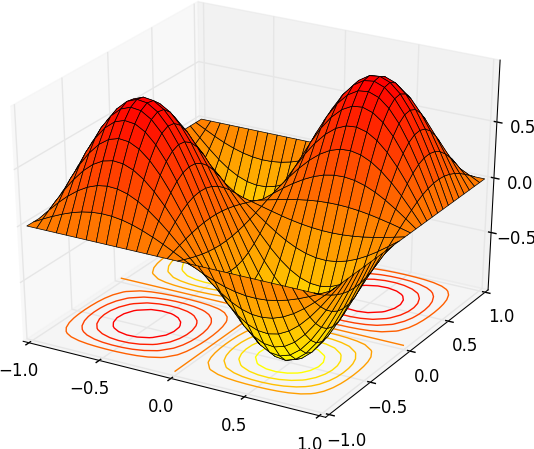
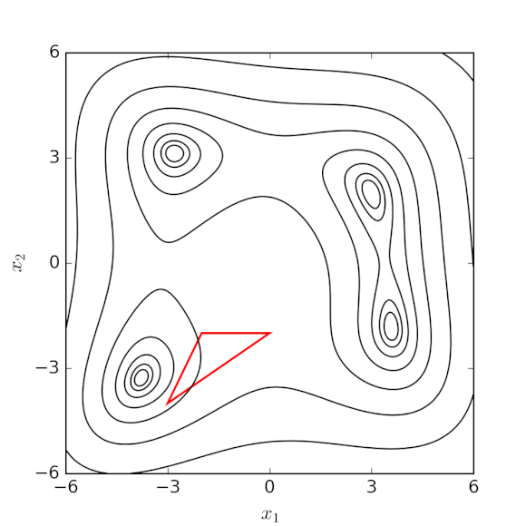
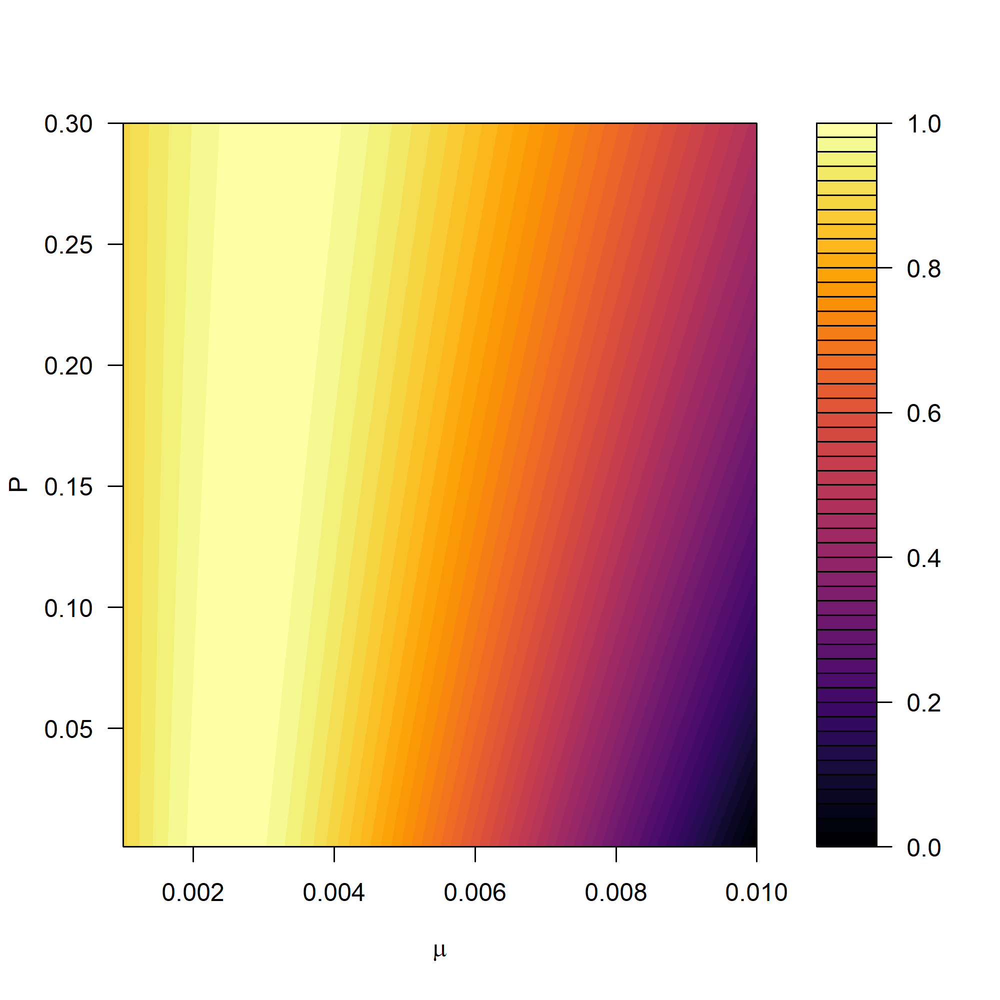
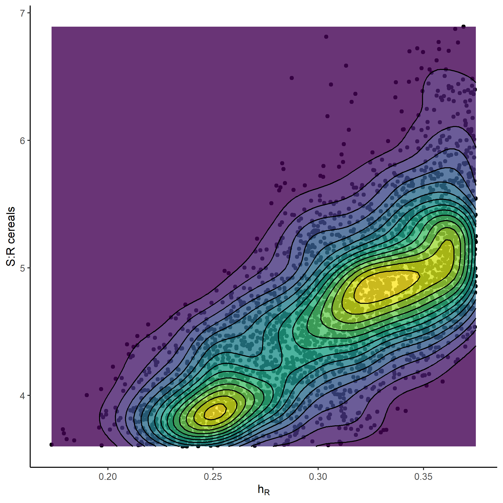

```{r setup, include=FALSE}
knitr::opts_chunk$set(echo = FALSE)
```

## The model parameter space
One way to define it is to consider model fitness on the x axis.

<div style="float: left; width: 58%;">
  <div class="centered">
{width=100%}
  </div>
</div>
<div style="float: right; width: 38%;">
Fitness is proportional to the likelihood of a particular solution. So the space is defined by the model parameters AND the data.   
  
...and rarely spaces will look so regular.
</div>

## A complex space is a problem for optimization algorithms


<div style="float: left; width: 48%;">
  <div class="centered">
{width=100%}
 https://en.wikipedia.org/wiki/Nelder-Mead_method
  </div>
</div>
<div style="float: right; width: 48%;">
* Optimization algorithms climb gradients, and stop at the top. If there are many local "tops" the algorithm might get trapped there and our solution might not be optimal.
* Models with multiple peaks with similar height are difficult to treat
</div>


## A space with no defined peak is a "problem" also for us
Often there are regions that look like elongated plateaus, rather than proper peaks.  
These are model solutions all with equal probabilities, and we cannot determine one single solution. **For all we know they are all true at the same time**.  
  
This indeterminedness is called by some **equifinality** (which term you use depends a bit on which tribe of modelers you identify with).

## An example of a bidimensional space
Considering a simple model of biomass production (single compartment, similar to Olson's SOC model) where the variation of biomass $B$ is defined by the production of mycelium $P$ minus the mortality of the living mycelium $\mu$ times the living biomass:
$$
\frac{dB}{dt}= P - \mu \cdot B
$$
This biomass model has only two parameters, and it is rather easy to visualize.

## An example of a bidimensional space
<div style="float: left; width: 58%;">
  <div class="centered">
{width=100%}
  </div>
</div>
<div style="float: right; width: 38%;">
The difficult thing was to determine the optimal model solution.  
  
Because there isn't one, there are many.
</div>

## A more relatable problem: recalibrating ICBM
<div style="float: left; width: 48%;">
One of the interactions in the model is between the inputs (so the allometric coefficients) and the transfer rate to the protected organic matter.
(the equifinality between inputs and kinetic parameter is a general characteristics of these models)
</div>
<div style="float: right; width: 48%;">
  <div class="centered">
{width=96%}
  </div>
</div>

## Remember that rarely a model space is only bidimensional!

Models have many more parameters, with usually a highly multidimensional space.
  
This is no big deal, just AVOID to try to visualize a multidimensional space. Remember just that any solution will scale, if it works for 2 dimensions it will work for 20.


## Ways to deal with the problem

1. Be aware of the risk. Repeat your optimizations to see if they are stable.
2. Use stochastic methods to explore the model space instead of relying on hill climbing methods.
3. As anything in modeling (as experimentalists complain about, rightly so), things can be always fixed with **more data!** Data add constraints to the model.

A stochastic procedure will rely on multiple realizations of the model with different parameter values. These will be usually spaced so to cover (and explore) most of the space we are interested in. We will cover the surface with a virtual "sampling campaign" with many points, from which we will then estimate the surface.


